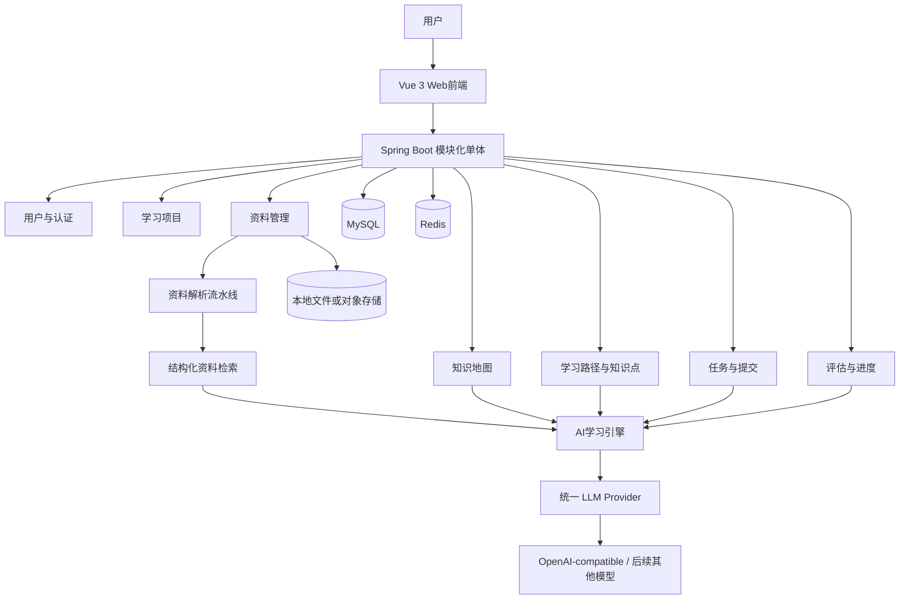
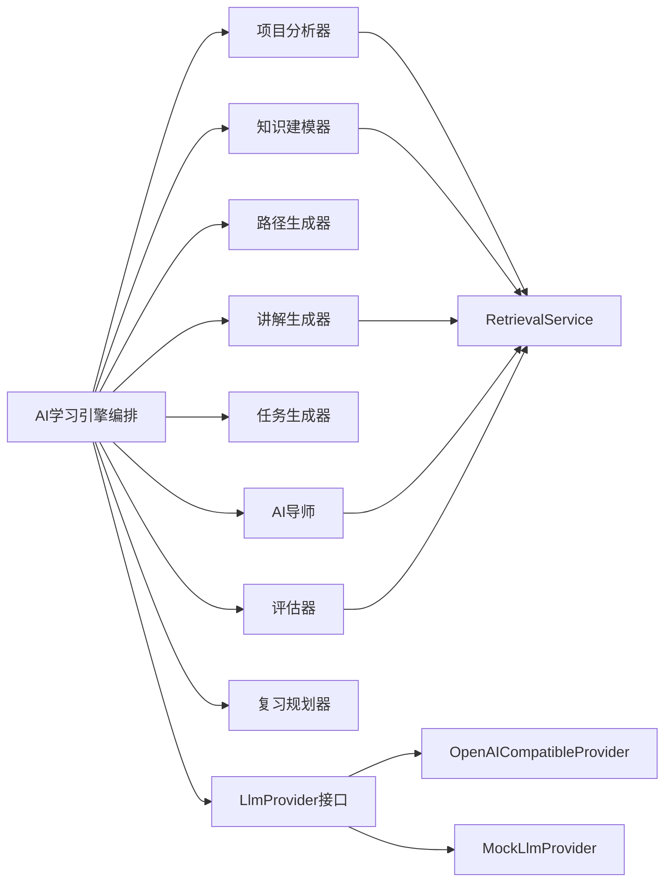
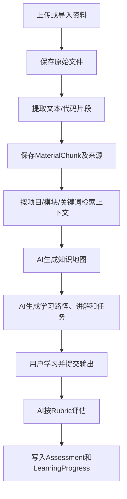
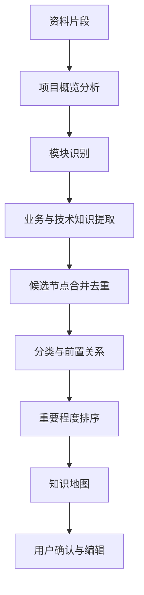
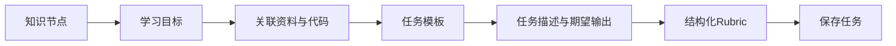
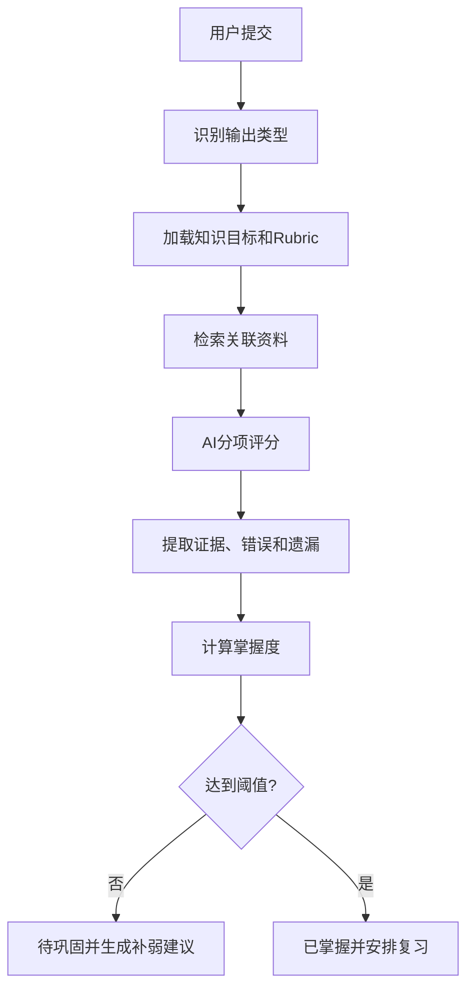

# ProjectLearn AI 技术架构文档

## 文档状态与架构原则

- 当前状态：架构已确定，代码尚未实现。
- 目标形态：可运行、可部署、易理解的模块化单体。
- 推荐栈：Vue 3 + TypeScript + Vite；Spring Boot 3 + Java 17；MyBatis-Plus；MySQL 8；Redis；Docker Compose。
- AI：统一 LLM Provider 接口，MVP 首先支持 OpenAI-compatible API，并提供 Mock Provider。
- 检索：MVP 采用结构化/关键词资料检索，暂不引入向量数据库。

## 系统总体架构



## 前端架构

技术：Vue 3、TypeScript、Vite、Vue Router、Pinia、Element Plus、Axios、Mermaid 和 Markdown 渲染组件。

```text
frontend/src/
├── api/              API客户端
├── components/       KnowledgeMap、LearningPath、AiMentor、MermaidViewer等
├── layouts/          页面布局
├── router/           路由
├── stores/            Pinia状态
├── views/             Dashboard、Project、Knowledge、Learning、Task、Assessment
├── types/             前后端共享语义类型
└── utils/             通用工具
```

以 Element Plus 为 MVP 主 UI 体系。Tailwind CSS、复杂编辑器和代码运行环境属于后续评估项。

## 后端架构

后端按业务模块组织，统一采用 `Controller → Service → Mapper → Database` 分层。业务模块不得直接依赖具体 AI 厂商 SDK。

```text
backend/src/main/java/com/projectlearn/
├── common/             响应、异常、安全、配置
├── user/               用户与认证
├── project/            学习项目
├── material/           资料导入与解析
├── knowledge/          知识节点与关系
├── learning/           学习路径、知识点和状态
├── task/               学习任务
├── submission/         用户输出
├── assessment/         掌握度评估与进度
└── ai/                 Provider、Prompt、编排、检索
```

## AI 模块架构



每个 AI 能力必须定义输入 DTO、Prompt 模板、结构化输出、错误处理和持久化结果。MVP 不使用自主 Agent；AI 由明确的后端业务流程调用。

## 数据流



## 核心业务流程

### 项目资料处理

支持范围按阶段实施：Markdown、TXT、PDF、代码目录/ZIP 和 URL。PDF 使用 PDFBox，Markdown 使用 Flexmark，HTML/URL 使用 Jsoup；源码 MVP 先按文件、类、函数或方法切分，并保存文件路径和行号来源。

### 知识地图生成



知识节点至少包含标题、摘要、学习目标、分类、难度、重要程度、前置节点、关联文件和关联模块。AI 结果是候选结果，用户拥有编辑权。

### 学习任务生成



MVP 任务类型：概念解释、代码阅读、流程复述、Mermaid 流程图、设计题、Bug 定位和场景迁移题。MVP 不要求在线编译或自动运行用户代码。

### 用户掌握度评估



初始状态可使用：未开始、学习中、待巩固、已掌握、需复习。评分必须解释依据；不以阅读完成或一次简单问答作为掌握证明。

## 数据模型

核心实体及字段如下（具体 SQL 尚未实现）：

- `user`：用户身份和偏好。
- `learning_project`：项目、来源、技术栈和状态。
- `project_material`：原始文件、路径、类型、解析状态和元数据。
- `material_chunk`：资料片段及其来源、行号和模块。
- `knowledge_node`：知识点内容、分类、难度、重要程度和来源。
- `knowledge_relation`：知识节点之间的前置/关联关系。
- `learning_path`、`learning_path_node`：学习路径及顺序。
- `learning_task`：任务描述、输出类型和 Rubric。
- `submission`：用户输出。
- `assessment`：分项评分、证据、薄弱点和建议。
- `learning_progress`：节点状态、掌握度、尝试次数和复习时间。

AI 原始响应和 Prompt 的持久化策略尚未最终确定，应在实现前决定脱敏和保留期限，不在当前文档中假定具体方案。

## API 边界

统一前缀：`/api/v1`。API 只表达业务边界，具体请求/响应 DTO 在开发时补充。

```text
POST/GET/PUT/DELETE /auth、/users
POST/GET/PUT/DELETE /projects
POST/GET            /projects/{id}/materials
POST/GET/PUT/DELETE /projects/{id}/knowledge-map、/knowledge-nodes
POST/GET/PUT        /projects/{id}/learning-path
GET/POST            /knowledge-nodes/{id}/lesson、/ask、/tasks
GET/POST            /tasks/{id}、/tasks/{id}/submissions
POST/GET            /submissions/{id}/assess、/assessments/{id}
GET/POST            /projects/{id}/progress、/progress/{nodeId}/review
```

## Redis 设计

Redis 只保存临时状态和缓存：解析进度、AI 请求幂等键、讲解/知识地图缓存、会话和限流计数。正式学习进度、任务提交和评估必须保存到 MySQL。MVP 不使用 Redis Stream 或复杂消息队列。

## 明确不做

当前架构不包含微服务、Kubernetes、消息队列、向量数据库、复杂 Agent、在线代码沙箱、社交系统、支付系统和手机端。除非后续需求和实际瓶颈明确出现，否则不引入这些基础设施。
