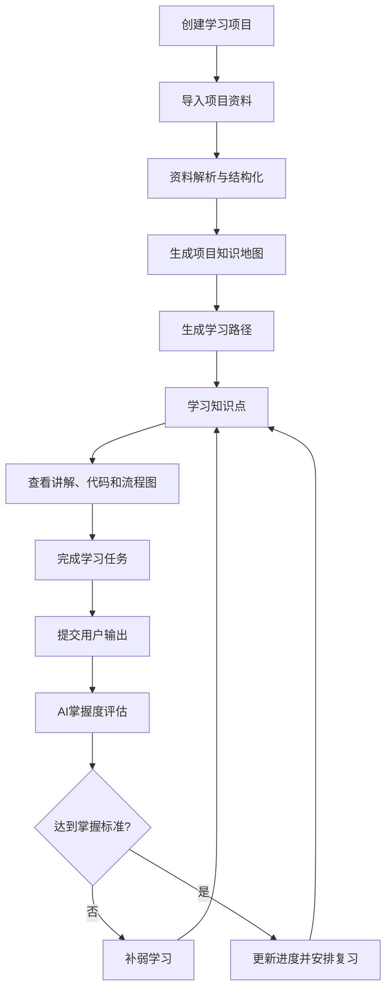

# ProjectLearn AI 产品需求文档

## 文档状态

- 文档性质：产品基线
- 当前状态：设计已确定，尚未开始实现
- 示例项目：黑马点评（HMDP）
- 产品原则：先完成可运行、可部署、可展示的 MVP，再扩展能力

## 产品定位

ProjectLearn AI 是一个面向程序员的 AI 项目制学习系统。它将真实软件项目的资料转换为知识地图、学习路径、学习任务和评估反馈，帮助用户通过“理解、实践、输出、验证、补弱、复习”真正掌握项目。

产品不是资料总结工具，也不是脱离项目上下文的通用聊天机器人。

## 用户痛点

1. 过度依赖长视频，学习过程缺少主动输出。
2. 文档和代码规模过大，不知道从哪里开始。
3. 能跟随教程实现，却无法独立解释、修改或扩展。
4. 缺少明确的知识结构、学习顺序和前置关系。
5. 不知道哪些知识点已经掌握，哪些仍然薄弱。
6. 学习缺少任务、反馈和复习机制。

## 目标用户

- 有基础但缺乏完整项目经验的初级开发者。
- 正在转型、希望通过真实项目学习新技术栈的开发者。
- 需要快速熟悉陌生 GitHub 项目的开发者。
- 需要把项目资料结构化为学习内容的技术内容创作者或培训者。

## 核心使用场景

1. 导入 HMDP，理解项目模块、技术栈和核心业务链路。
2. 打开“优惠券秒杀”等模块，按知识点学习并查看 Mermaid 流程图。
3. 完成概念解释、流程复述、代码阅读或设计任务，提交自己的输出。
4. 由 AI 根据评分标准评估掌握度，生成补弱建议和复习安排。
5. 导入其他 Java、Spring Boot、前端或 Python 项目，复用相同学习流程。

## 核心功能

- 创建和管理学习项目。
- 导入 Markdown、PDF、TXT、代码目录、ZIP 或 URL 资料（按阶段实现）。
- 解析项目资料并保留原始文件来源。
- AI 生成项目知识地图、节点分类和前置关系。
- AI 生成分阶段、有顺序的学习路径。
- 知识点学习页：讲解、代码/资料来源、Mermaid 图和学习状态。
- 基于当前项目上下文的 AI 导师。
- 生成和完成学习任务，支持文本、代码和 Mermaid 等输出。
- 基于证据的 AI 掌握度评估、薄弱点和下一步建议。
- 项目、阶段和知识点维度的学习进度。

## MVP 范围

MVP 必须跑通一条完整闭环：

```text
创建项目 → 导入资料 → 生成知识地图 → 生成学习路径
→ 学习知识点 → 完成任务 → 提交输出 → AI评估 → 更新状态和进度
```

MVP 目标是支持 HMDP 的可运行演示，采用模块化单体、Vue 3、Spring Boot、MySQL、Redis、统一 LLM Provider 和结构化资料检索。

## 非 MVP 范围

- 社交、评论、排行榜和多人实时协作。
- 支付、复杂商业化和企业组织权限。
- 手机 App。
- 微服务、Kubernetes、消息队列和复杂 Agent 编排。
- 向量数据库、过度复杂的 RAG。
- 任意用户代码的在线执行、自动修复完整项目。
- 全自动高精度代码语义分析。
- 跨项目能力画像、课程市场和教师工作台。

## 用户完整使用流程



## 产品核心学习闭环

> 理解 → 实践 → 输出 → 验证 → 补弱 → 复习

“已打开页面”或“点击已学习”不等于掌握。掌握度必须基于概念解释、代码理解、流程复述、任务完成、问题排查或变体迁移等输出证据。

## 后续版本规划

### Phase 2 方向

- GitHub 仓库一键导入和 Git 提交历史分析。
- 代码调用关系图、API 调试任务和更丰富的任务模板。
- 间隔复习、个人能力画像、知识地图编辑增强。
- 浏览器代码编辑/运行环境（在安全边界明确后）。
- 多模型 Provider 和项目资料增量更新。

### Phase 3 方向

- 教师/作者发布学习项目和项目课程市场。
- 团队学习空间、企业代码库接入。
- 代码沙箱与自动测试、多模态资料。
- 跨项目知识迁移、学习成果报告和插件系统。

以上是未来计划，不代表当前已经实现。
